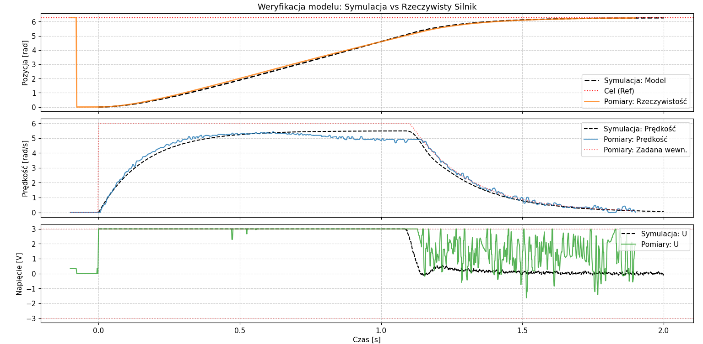
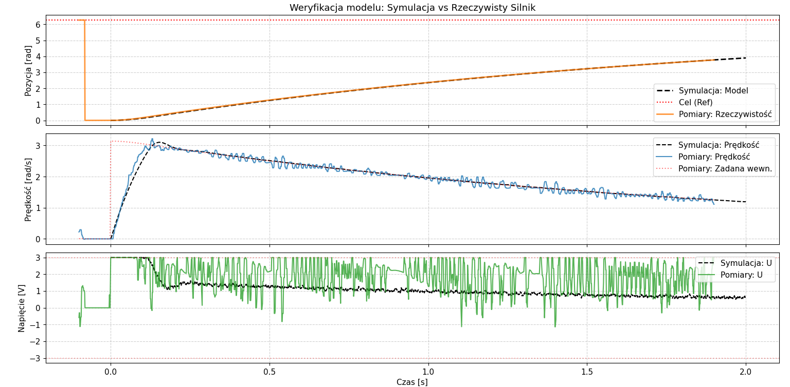
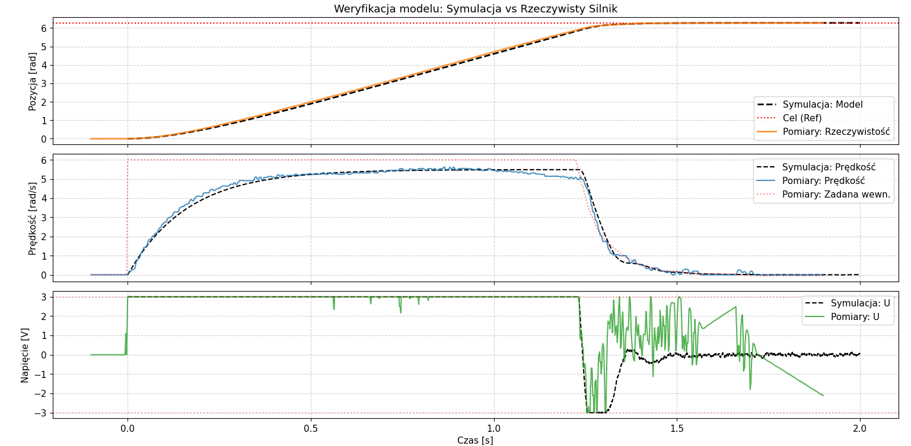

# DC Motor Cascaded PID Position Controller (STM32)

This project implements a **Cascaded PID Controller** for a DC Motor using an **STM32L476RG** microcontroller. The system operates in a "Master-Slave" electronic gearing configuration, where the motor tracks the position of a manual reference encoder (handwheel).

The project includes hardware firmware (C/HAL) and a simulation model (Python) for control strategy validation.

## 🚀 Key Features

* **Cascaded Control Architecture:**
    * **Outer Loop:** P-Controller for Position.
    * **Inner Loop:** PID Controller for Angular Velocity with **Derivative on Measurement** configuration.
* **Real-Time Execution:** Deterministic **500 Hz** ($T_s = 2ms$) control loop triggered by hardware timer interrupts (`TIM2`).
* **Signal Processing:** 2nd-order IIR Bi-Quad filter applied to the raw encoder velocity to suppress quantization noise.
* **Robustness:**
    * **Anti-Windup:** Dynamic Clamping method to prevent integral saturation when voltage limit is reached.
    * **Output Saturation:** Voltage limiting (Default: $\pm 3.0V$) based on power supply.
* **Telemetry:** Real-time data logging via UART (115200 baud, ~20Hz update rate) for tuning and visualization.

## 🛠 Hardware Configuration

* **MCU:** STM32L476RGTx (Nucleo-L476RG Board)
* **Motor Driver:** H-Bridge (PWM + Direction pins)
* **Sensors:**
    * **Slave:** Mechanical Pulse Encoder (CPR: 3840.0)
    * **Master:** Manual Pulse Generator / Knob (CPR: 80.0)

### Pinout Mapping

| STM32 Pin | Function | Peripheral | Description |
| :--- | :--- | :--- | :--- |
| **PA6, PA7** | Encoder A/B | `TIM3` | **Motor Feedback Encoder** (Slave) |
| **PC6, PC7** | Encoder A/B | `TIM8` | **Reference Input Encoder** (Master/Knob) |
| **PB6** | PWM Output | `TIM4_CH1` | PWM Signal for Motor Driver |
| **PB4** | GPIO Output | `GPIO` | Motor Direction IN1 |
| **PB5** | GPIO Output | `GPIO` | Motor Direction IN2 |
| **PA2, PA3** | UART TX/RX | `USART2` | Debugging & Telemetry PC Interface |

## 🧠 Control Algorithm

The control law is calculated inside the `HAL_TIM_PeriodElapsedCallback` (Timer 2 Interrupt) every **2 ms**.

### 1. Position Loop (Outer)
Calculates the desired angular velocity based on position error.
$$\omega_{target} = K_{p\_pos} \cdot (\theta_{ref} - \theta_{meas})$$
* **Gain:** $K_{p\_pos}$ is tunable (see Results section).
* **Saturation:** $\pm 6.0$ rad/s

### 2. Velocity Loop (Inner)
Regulates the voltage applied to the motor. The **Derivative term acts on the Measurement** (not error) to prevent "derivative kick" during setpoint changes.

$$u(t) = \underbrace{K_p \cdot e(t)}_{P} + \underbrace{K_i \int e(t) dt}_{I} - \underbrace{K_d \frac{d\omega_{meas}}{dt}}_{D}$$

Where:
* $e(t) = \omega_{target} - \omega_{filt}$
* $\omega_{filt}$ is the velocity after IIR filtering.
* **Gains:** $K_p = 5.0$, $T_i = 0.2s$, $T_d = 0.005s$.

### 3. Digital Tachometer (Differentiation & Filtering)
Since the system uses a **mechanical pulse encoder**, velocity is derived numerically:
1.  **Raw Diff:** $\Delta \theta / T_s$
2.  **IIR Filter:** A 2nd-order filter smooths the quantization noise:
    $$y[n] = b_0 x[n] + b_1 x[n-1] + b_2 x[n-2] - a_0 y[n-1] - a_1 y[n-2]$$

## 📊 Results: Model vs. Real Hardware

The plots below validate the accuracy of the Python simulation model against the physical hardware. The experiments show the system response under **different Position P-Gain ($K_{p\_pos}$)** settings.

Across all gain values, the simulation (Black Dashed Line) closely follows the real measurements (Colored Lines), confirming the correctness of the identified motor parameters and the digital filter model.

### Scenario 1: High Position Gain

*In this scenario, the high gain causes the velocity (Middle plot) to immediately hit the saturation limit of **6.0 rad/s**. The model accurately predicts the saturation time and the deceleration curve.*

### Scenario 2: Low Position Gain

*With a lower P-gain, the system response is overdamped. The velocity never reaches saturation, and the position (Top plot) rises slowly. The simulation perfectly overlaps with the real encoder data.*

### Scenario 3: Intermediate Tuning

*An intermediate gain setting showing a balance between response time and stability. Note the slight noise in the voltage signal (Green, Bottom plot) which corresponds to the derivative action handling the real-world encoder noise.*

## 💻 Software Structure

### Firmware (`/Core/Src`)
* `main.c`: Contains the main loop, initialization, and the **Control Loop ISR**.
    * **Sampling Time ($T_s$):** 0.002s
    * **Voltage Supply:** Defined as `3.0V` (adjustable via macro).
* `tim.c`: Hardware timer configurations (Encoder mode, PWM generation, Interrupt base).

### Simulation (`/Simulation`)
* `Projekt Symulacja.py`: A Python script using `numpy` and `scipy`.
    * Simulates the motor plant model.
    * Used for tuning PID gains before deploying to hardware.

## 🔧 How to Run

1.  **Hardware Setup:** Connect the DC Motor driver and Encoders to the Nucleo pins as listed in the table.
2.  **Flash:** Open the project in **STM32CubeIDE** and flash the target.
3.  **Monitor:**
    * Open a Serial Terminal (Putty/RealTerm).
    * Baudrate: **115200**.
    * Format: `POS: 3.14 | REF: 3.14 | SPD: 0.05 | PWM: 3.0`
4.  **Control:** Rotate the "Master" encoder; the motor should follow the position immediately.

## 📜 License
This project is open-source.
